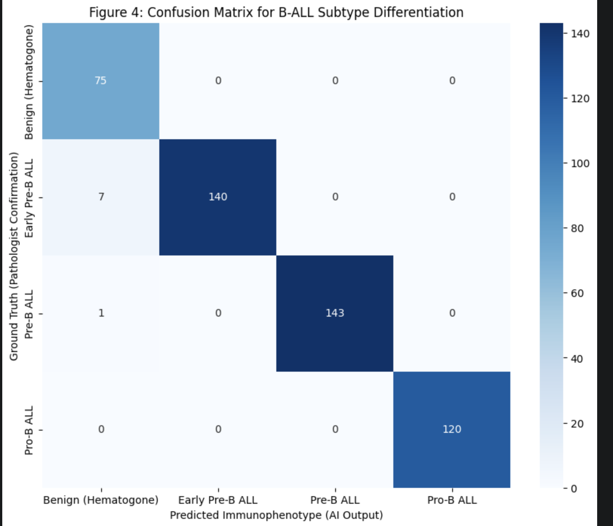
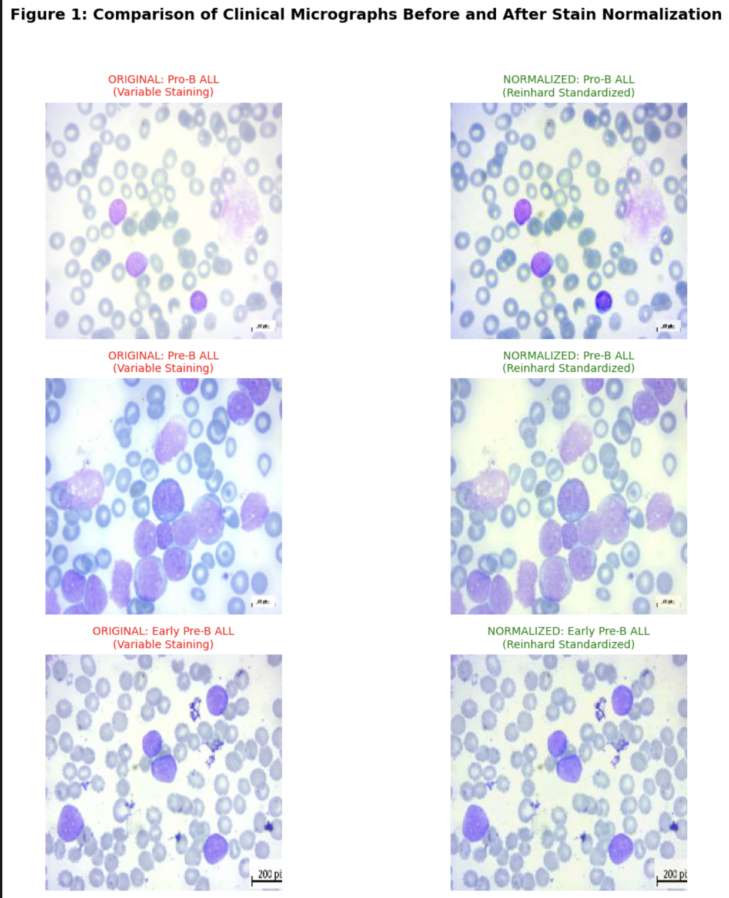

# Automated Immunophenotyping of B-ALL Subsets via Deep Residual Learning

**Author:** Mukaram Ali (BSc Hons Medical Laboratory Technology)  
**Domain:** Computational Hematopathology / AI in Healthcare  

---

## 🔬 Abstract
Acute Lymphoblastic Leukemia (ALL) subtyping traditionally requires flow cytometry, which is resource-intensive. This research presents a deep learning pipeline using **ResNet50** to perform **"Virtual Immunophenotyping"** directly from digital peripheral blood films. By standardizing morphology via **Reinhard Stain Normalization**, the model differentiates between **Early Pre-B, Pre-B, and Pro-B ALL** with high clinical precision.

## 📊 Performance & Validation
### Diagnostic Accuracy: 98.35%
The model demonstrates exceptional robustness in distinguishing malignant lymphoblasts from **Benign Hematogones**, a common diagnostic pitfall in hematopathology.

## 🧪 Methodology: Stain Normalization
To address clinical variability in Giemsa/Wright staining protocols, we implemented Reinhard Method normalization in the LAB color space. This ensures the model learns morphological biomarkers (N:C ratio, chromatin density) rather than staining artifacts.

## 🛠️ Project Structure
* `Automated_Immunophenotyping_B-ALL_ResNet50.ipynb`: Full end-to-end research code and training logs.
* `Samples/`: Representative clinical micrographs (Original vs. Normalized).
* `Model_Confusion_Matrix.png`: Heatmap validation of model sensitivity and specificity.
* `Stain_Normalization_Results.png`: Visual evidence of color-space standardization.

## 🧫 Data Source & Biological Context
Based on the **Taleqani Hospital Dataset**, the project models the biological continuum of B-cell ontogeny from Pro-B to mature stages.

📄 **Project Summary (PDF)**: *B-ALL_DeepLearning_Summary.pdf*  https://github.com/mukaram163/B-ALL-Immunophenotyping-DeepLearning/blob/main/B-ALL_DeepLearning_Summary.pdf

---
*Developed for the Amgen Scholars / NUS Research Application portfolio.*
